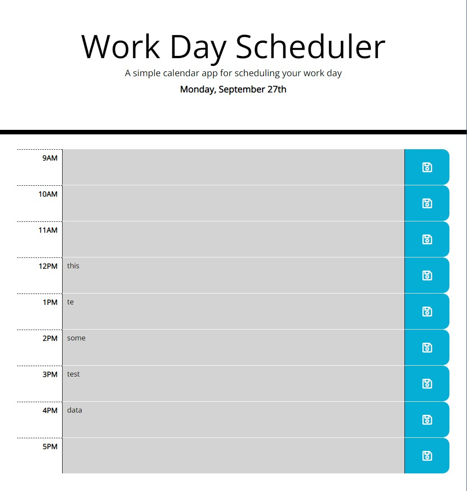

# work-day-scheduler-momentjs

## Description

Simple calendar application that allows a user to save events for each hour, or time-block, of their work day, and utilizes Moment.js, Bootstrap, and jQuery to speed development. This scheduler app shows the user the current local date, then lets the user ender a task or event, and hit the save icon to tie that event to their storage. On the next page load, all the user's task will remain in place!

Please note, while Moment.js has been used by millions to 'parse, validate, manipulate,and display dates and times in JavaScript,' but the project is currently in it's maintenance phase, and not looking to incorporate new features. They encourage new projects to embrace more modern alternatives for date and time manipulation. Please see [their project status page for more details](https://momentjs.com/docs/#/-project-status/).

## Link to Deployment

Link to the [GitHub Pages deployment](https://graybishop.github.io/work-day-scheduler-momentjs/)

## Screenshot

## Tech Stack

* HTML5
* CSS3
* Bootstrap
* jQuery
* Moment.js
